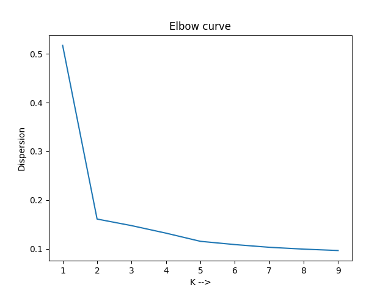

- **kmeans_cluster.py**
    - Take single file(income.csv) and groups the data into optimum number of groups using k means cluster algorithm and computes elbow method plot

    - elbow method plot (for Q2): 
    
    

    - optimal K value (for Q2): 2
